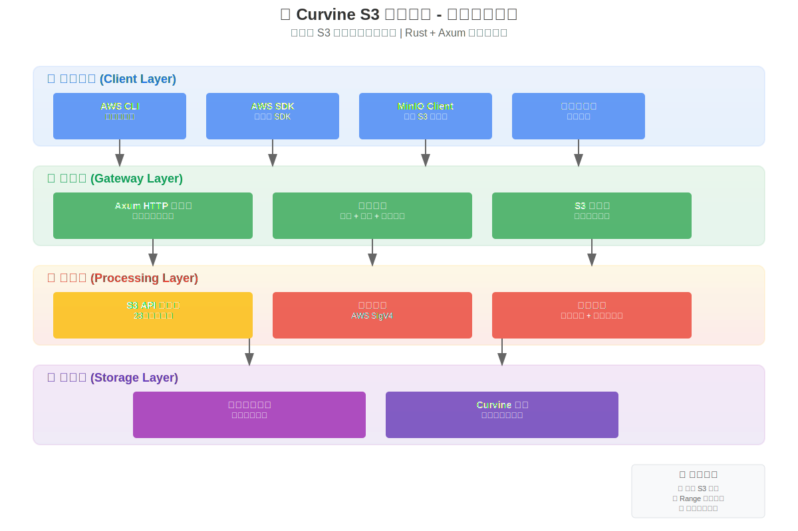
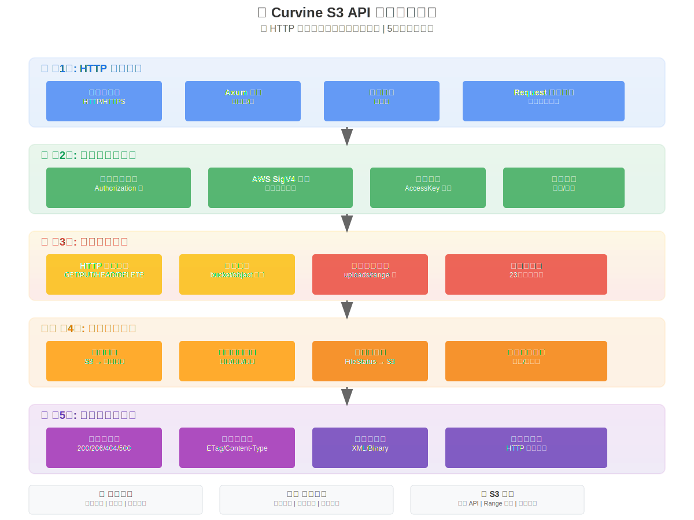
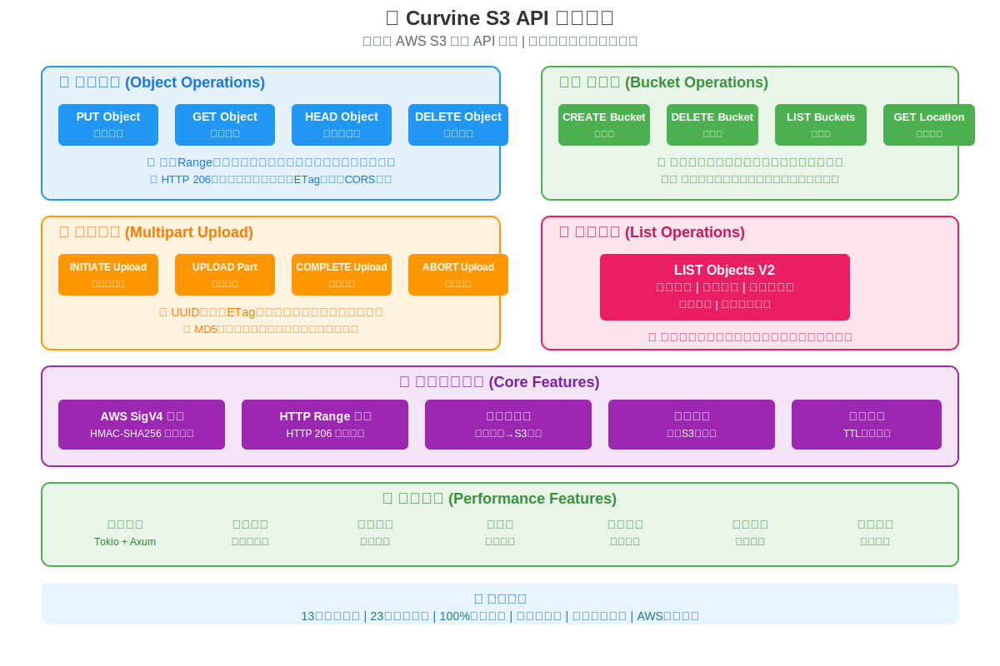

# Curvine S3 对象网关 - 技术实现文档

## 目录

1. [项目概述](#项目概述)
2. [系统架构](#系统架构)
3. [核心组件](#核心组件)
4. [请求处理流程](#请求处理流程)
5. [S3 API 实现](#s3-api-实现)
6. [认证与授权](#认证与授权)
7. [错误处理策略](#错误处理策略)
8. [性能优化](#性能优化)
9. [开发指南](#开发指南)
10. [测试与调试](#测试与调试)

## 项目概述

Curvine S3 对象网关是一个基于 Rust 和 Axum 构建的高性能、S3 兼容的对象存储网关。它为 Curvine 分布式文件系统提供了完整的 AWS S3 API 兼容层，使现有的 S3 客户端工具和应用程序能够无缝接入 Curvine 存储集群。

### 核心特性

- **🔄 完整 S3 兼容性**: 支持所有主要 S3 操作，包括对象 CRUD、桶管理和分片上传
- **⚡ 高性能架构**: 基于 Axum 和 Tokio 的异步高吞吐量处理
- **🛡️ 企业级安全**: 完整的 AWS Signature V4 认证实现
- **📈 可扩展架构**: 模块化设计支持水平扩展
- **🔀 Range 请求支持**: HTTP 206 部分内容下载，高效处理大文件流
- **📦 分片上传**: 完整实现 S3 分片上传协议

### 技术栈

系统采用现代化的技术栈确保高性能和可靠性：

- **核心语言**: Rust - 提供内存安全、零成本抽象和出色的并发性能
- **Web 框架**: Axum - 现代异步 HTTP 框架，具备优秀的类型安全性和性能
- **异步运行时**: Tokio - 行业标准的异步运行时，支持高并发处理
- **存储后端**: Curvine 统一文件系统 - 提供统一的文件系统抽象层
- **认证协议**: AWS Signature V4 - 业界标准的认证机制，基于 HMAC-SHA256
- **序列化格式**: XML - S3 API 标准响应格式

## 系统架构

### 整体架构图

*Curvine S3 对象网关采用清晰的四层架构设计，从客户端到存储的完整数据流向*

### 四层架构设计

#### 1. 客户端层 (Client Layer)
客户端层支持各种标准的 S3 客户端工具和应用程序。这一层的设计目标是确保完全的 AWS S3 兼容性，让用户可以无缝迁移现有的应用程序。支持的客户端包括 AWS CLI、各种语言的 AWS SDK、MinIO Client、S3 Browser 等图形化工具，以及任何使用 S3 API 的自定义业务应用程序。

#### 2. 网关层 (Gateway Layer)  
网关层是系统的 HTTP 服务入口，负责处理所有的客户端请求。基于 Axum 框架构建的高性能 HTTP/HTTPS 服务器，具备出色的并发处理能力。这一层集成了完整的中间件链，包括请求认证、访问日志记录、错误处理、请求限流等横切关注点的处理。智能路由系统能够根据 HTTP 方法和 URL 路径，将请求精确地分发到相应的处理器。

#### 3. 处理层 (Processing Layer)
处理层是业务逻辑的核心，包含了所有 S3 API 操作的具体实现。这一层负责 S3 请求的解析、验证、处理和响应生成。AWS SigV4 签名验证模块确保请求的安全性和完整性。路径映射模块负责将 S3 的桶和对象路径转换为文件系统路径。元数据转换模块将文件系统的元数据格式转换为 S3 兼容的响应格式。

#### 4. 存储层 (Storage Layer)
存储层通过统一文件系统接口连接到 Curvine 分布式存储集群。统一文件系统提供了抽象的存储接口，屏蔽了底层存储的复杂性，支持多种存储后端。Curvine 集群提供真正的数据存储能力，具备分布式特性、高可用性和数据冗余保护。

## 核心组件

### HTTP 处理组件

#### 主要 HTTP 处理模块
HTTP 处理的核心是位于 `curvine-object/src/http/axum.rs` 的主入口模块。这个模块作为整个 HTTP 处理流程的协调中心，负责请求的初始接收和响应的最终发送。主要功能包括统一的请求路由分发，将所有进入的 HTTP 请求按照方法和路径进行分类处理。中间件系统的集成确保每个请求都经过必要的认证、日志记录和错误处理流程。S3 兼容的 XML 响应格式化保证了与标准 S3 API 的完全兼容性。

#### S3 路由器模块
S3 路由器模块位于 `curvine-object/src/http/router.rs`，采用高度模块化的设计理念。这个模块将复杂的路由逻辑分解为清晰的层级结构。主路由方法 `route()` 作为统一入口点，接收所有 HTTP 请求并按照 HTTP 方法进行第一级分发。五个专门的 HTTP 方法处理器（PUT、GET、DELETE、HEAD、POST）处理不同类型的 HTTP 请求。在更细粒度的层面，十八个专门的操作处理方法负责具体的 S3 操作，如对象上传、下载、删除、桶创建等。

这种设计带来了显著的优势：代码结构清晰易懂，每个方法职责单一；维护成本大幅降低，修改某个特定操作不会影响其他功能；测试覆盖更加全面，可以针对每个操作进行独立测试；错误处理更加精确，可以为不同操作提供专门的错误处理逻辑。

### S3 API 组件

#### S3 API 接口定义
S3 API 接口模块 `curvine-object/src/s3/s3_api.rs` 定义了所有 S3 操作的标准接口。这些接口采用 Rust 的 trait 系统实现，确保了类型安全和编译时检查。主要的 trait 包括对象操作相关的 `PutObjectHandler`、`GetObjectHandler`、`HeadHandler`、`DeleteObjectHandler`，桶操作相关的 `CreateBucketHandler`、`DeleteBucketHandler`、`ListBucketHandler`，以及高级功能如 `ListObjectHandler` 和 `MultiUploadObjectHandler`。

每个 trait 都定义了清晰的输入参数和返回值类型，确保 API 的一致性和可预测性。数据结构如 `HeadObjectResult`、`ListObjectContent`、`Bucket`、`Owner` 等提供了完整的 S3 响应数据模型。

#### S3 处理器实现
S3 处理器的具体实现位于 `curvine-object/src/s3/handlers.rs`。核心的 `S3Handlers` 结构体集成了统一文件系统接口、S3 区域信息和异步运行时，为所有 S3 操作提供必要的执行环境。

路径映射是这个模块的重要功能，它将 S3 的概念模型映射到文件系统路径。S3 桶被映射为文件系统的根目录，S3 对象路径直接对应文件系统中的文件路径。这种简单直观的映射关系确保了操作的一致性和可预测性。

所有操作都采用异步优先的设计，确保高并发场景下的性能表现。流式处理机制支持大文件的高效传输，无需在内存中缓存完整文件内容。完整的错误处理和 S3 兼容响应确保了客户端的良好体验。

#### PUT 操作优化模块
PUT 操作的优化实现位于 `curvine-object/src/s3/types.rs`。这个模块采用模块化的设计理念，将复杂的 PUT 操作分解为清晰的组件。`PutContext` 结构体封装了 PUT 操作所需的所有上下文信息，包括文件系统引用、异步运行时、桶名、对象名和路径解析结果。

`PutOperation` 结构体作为操作编排器，负责协调整个 PUT 操作的执行流程。它的 `execute` 方法实现了完整的上传逻辑，包括数据流处理、写入操作、错误处理和资源清理。`UploadStats` 结构体提供了详细的上传统计信息，包括写入字节数、处理的数据块数量和操作耗时。

这种模块化设计带来了显著的好处：代码更加清晰易读，职责分离明确；可测试性大幅提升，每个组件都可以独立测试；可维护性更好，修改某个功能不会影响其他部分；可扩展性更强，可以方便地添加新的功能如进度回调、断点续传等。

### 认证组件

#### 认证核心模块
认证系统的核心实现位于 `curvine-object/src/auth/mod.rs`。这个模块支持多种 AWS 认证协议，包括传统的 AWS Signature V2 和主流的 AWS Signature V4。HMAC-SHA256 加密签名验证确保了请求的安全性和完整性。

凭证存储系统采用 trait 设计，支持多种存储后端。`AccesskeyStore` trait 定义了凭证存储的标准接口，`StaticAccessKeyStore` 提供了基于内存的实现。系统支持多种凭证配置方式：单密钥对配置适合简单场景，环境变量配置适合容器化部署，安全随机凭证生成适合开发和测试环境。

安全特性包括环境变量优先的凭证加载策略，确保敏感信息不被意外泄露；密钥的安全存储和快速查找，支持高并发访问；防时序攻击的常数时间操作，避免通过响应时间推断密钥信息；完整的审计日志支持，记录所有认证相关的操作。

#### AWS Signature V4 实现
AWS Signature V4 的完整实现位于 `curvine-object/src/auth/sig_v4.rs`。这个模块实现了标准的 AWS SigV4 签名验证流程，确保与 AWS S3 的完全兼容性。

签名验证的核心流程包括：首先解析 HTTP 请求中的 Authorization 头部，提取访问密钥、签名和已签名头部列表；然后重构标准请求字符串，按照 AWS 规范对请求进行标准化处理；接着计算 HMAC-SHA256 签名，使用派生的签名密钥对标准化请求进行签名；进行时间戳验证以防止重放攻击，确保请求的时效性；最后进行签名比对和访问控制，验证请求的合法性。

时间戳验证机制防止重放攻击，通过检查请求时间戳与当前时间的差异，拒绝过期的请求。这种设计在保证安全性的同时，也考虑了网络延迟和时钟漂移的实际情况。

### 工具组件

#### 元数据转换工具
元数据转换工具位于 `curvine-object/src/utils/utils.rs`，负责将文件系统的元数据格式转换为 S3 兼容的响应格式。这是确保 S3 兼容性的关键组件。

核心转换功能包括时间戳格式化，将文件系统的时间戳转换为 S3 标准的 RFC3339 格式；存储类映射，根据文件的存储类型决定相应的 S3 存储类；内容类型推断，根据文件扩展名智能推断 MIME 类型；ETag 生成，为每个对象生成唯一的标识符；完整的对象元数据转换，将 `FileStatus` 转换为 `HeadObjectResult` 和 `ListObjectContent`。

转换特性包括无缝的格式转换，确保所有元数据都能正确映射；TTL 信息支持，将存储策略中的生存时间信息转换为 S3 的过期标记；MIME 类型的智能推断，基于文件扩展名和内容特征进行类型识别；所有者和权限信息的完整映射，确保访问控制信息的准确传递。

## 请求处理流程

### 完整请求生命周期

*从S3客户端到Curvine存储集群的完整请求处理生命周期，展示了高性能异步处理的每个关键步骤*

### 请求处理的详细步骤

请求处理流程从客户端发起 HTTP 请求开始，经过多个处理层，最终访问存储系统并返回响应。整个流程设计为高性能的异步处理模式，确保优秀的并发性能和响应时间。

**第一阶段：请求接收与解析**
Axum HTTP 服务器接收来自客户端的请求，进行基础的 HTTP 解析。这个阶段包括 HTTP 头部的解析，提取请求方法、路径、查询参数等信息；URL 路径的分析，识别桶名、对象名等 S3 特定的路径组件；查询参数的提取，处理分页、过滤等可选参数；操作类型的识别，根据 HTTP 方法和路径模式确定具体的 S3 操作类型。

**第二阶段：认证与授权**
所有请求都必须经过严格的身份认证流程。Access Key 验证确保请求来自合法的用户；HMAC 签名校验验证请求的完整性和真实性；时间戳检查防止重放攻击；权限验证确保用户有权限执行请求的操作。认证失败的请求会立即返回相应的错误响应，不会进入后续的处理流程。

**第三阶段：业务逻辑处理**
通过认证的请求进入业务逻辑处理阶段。路径转换将 S3 的桶和对象路径映射为文件系统路径；参数验证确保所有必需的参数都存在且格式正确；业务逻辑执行根据操作类型调用相应的处理器；错误处理机制捕获和处理各种可能的异常情况。

**第四阶段：文件系统操作**
业务逻辑处理完成后，系统与底层文件系统进行交互。读写操作直接操作文件数据；元数据处理管理文件的属性信息；存储策略应用根据配置的策略处理文件；完整性检查确保数据的正确性和一致性。

**第五阶段：响应构建与发送**
最后阶段是构建和发送响应给客户端。XML 格式化将响应数据转换为 S3 标准的 XML 格式；HTTP 头设置添加必要的响应头信息；状态码设定根据操作结果设置正确的 HTTP 状态码；响应发送将最终响应传递给客户端。

### 特殊操作流程

**PUT 对象操作流程**
PUT 对象操作是最复杂的操作之一，涉及大量数据的流式传输。流程开始于客户端上传请求的接收，然后进行认证验证和路由分发。系统创建 PUT 操作上下文，包含所有必要的执行环境信息。路径验证和转换确保目标路径的合法性。创建文件写入器准备接收数据。数据流式读取和写入避免内存溢出，支持大文件上传。操作完成后进行资源清理，确保系统资源的正确释放。

**GET 对象 Range 请求流程**
Range 请求支持断点续传和部分内容下载，这对于大文件的网络传输非常重要。流程包括 Range 头部的解析，提取起始和结束位置信息；Range 参数的验证，确保请求的范围合法有效；文件读取器的打开，准备读取指定文件；定位到起始位置，使用 seek 操作跳转到指定偏移；计算需要读取的字节数，确定传输范围；分块读取和流式写入响应，避免内存占用过大；达到结束位置后完成传输；最后清理读取器资源并返回 HTTP 206 响应。

## S3 API 实现

*完整的AWS S3兼容API实现清单，涵盖对象操作、桶管理、分片上传等所有主要功能*

### S3 API 完整性概述

Curvine S3 对象网关实现了完整的 AWS S3 API 兼容性，支持所有主要的对象存储操作。系统设计的目标是确保现有的 S3 客户端工具和应用程序可以无缝迁移到 Curvine 平台，无需任何修改。

### 对象操作实现

对象操作是 S3 API 的核心功能，包括对象的创建、读取、更新和删除。系统支持完整的对象生命周期管理，从上传到删除的每个阶段都提供了丰富的功能特性。

**PutObject 操作**提供了完整的对象上传功能，支持流式传输技术，可以处理任意大小的文件而不受内存限制。上传过程中保存完整的元数据信息，包括文件大小、修改时间、内容类型等。系统还支持自定义元数据的存储，允许用户添加业务相关的标签信息。

**GetObject 操作**实现了高效的对象下载功能，特别是对 HTTP Range 请求的完整支持。Range 请求允许客户端只下载文件的特定部分，这对于实现断点续传、视频流播放等场景非常重要。系统返回标准的 HTTP 206 Partial Content 响应，确保与客户端的完美兼容。

**HeadObject 操作**提供快速的对象元数据查询功能，无需下载对象内容就能获取完整的元数据信息。这对于检查对象是否存在、获取文件大小、验证缓存有效性等场景非常有用。响应包含所有标准的 S3 元数据字段，确保客户端的正常工作。

**DeleteObject 操作**实现了安全的对象删除功能，采用幂等设计，多次删除同一对象不会产生错误。删除操作包含完整的权限检查，确保只有授权用户才能删除对象。

### 桶操作实现

桶操作管理存储命名空间，为对象提供逻辑分组功能。系统实现了完整的桶生命周期管理，确保桶操作的安全性和一致性。

**CreateBucket 操作**支持桶的创建和初始化，包含严格的桶名验证机制，确保桶名符合 S3 命名规范。系统支持权限设置和区域配置，为桶提供适当的访问控制和地理位置信息。

**DeleteBucket 操作**实现安全的桶删除功能，包含空桶检查机制，确保只有空桶才能被删除。删除过程包含完整的权限验证，防止未授权的删除操作。

**ListBuckets 操作**提供用户可访问桶的完整列表，返回每个桶的详细元数据，包括创建时间、所有者信息等。响应格式完全符合 S3 标准，确保客户端的正确解析。

**GetBucketLocation 操作**返回桶的区域信息，支持合规性要求和地理位置相关的业务逻辑。

### 列表操作实现

**ListObjectsV2 操作**是最复杂的列表功能之一，支持丰富的查询和过滤选项。前缀过滤允许用户只列出特定前缀的对象，这对于实现目录浏览功能非常有用。分页支持确保即使在包含大量对象的桶中也能提供良好的性能。分隔符处理允许客户端实现目录结构的模拟，提供类似文件系统的用户体验。

系统返回完整的对象元数据，包括文件大小、修改时间、ETag、存储类等信息。高性能的分页机制确保即使面对包含数百万对象的桶也能快速响应。智能的过滤算法优化查询性能，减少不必要的存储访问。

### 分片上传实现

分片上传是处理大文件的标准机制，允许将大文件分解为多个小片段并行上传，显著提高上传效率和可靠性。

**InitiateMultipartUpload 操作**创建分片上传会话，生成唯一的上传标识符。系统使用 UUID 确保标识符的全局唯一性，并建立上传会话的元数据管理。

**UploadPart 操作**处理单个分片的上传，每个分片都会生成唯一的 ETag 用于完整性验证。系统支持分片的并发上传，显著提高大文件上传的效率。每个分片的大小和顺序都会被严格记录。

**CompleteMultipartUpload 操作**将所有上传的分片合并为最终的对象。系统会验证所有分片的完整性，确保最终对象的正确性。合并过程采用高效的算法，减少额外的存储访问。

**AbortMultipartUpload 操作**提供取消分片上传的功能，包含完整的资源清理机制，确保已上传的分片不会占用存储空间。这个功能对于错误恢复和资源管理非常重要。

### S3 兼容性特性

系统实现了完整的 S3 兼容性特性，确保与标准 S3 API 的完美兼容。HTTP 状态码的精确映射确保客户端能够正确理解响应结果。响应头部的完整支持包括所有标准的 S3 头部字段，如 Content-Length、Last-Modified、ETag 等。

Range 请求的完整支持包括单范围和多范围请求，响应格式严格遵循 HTTP 标准。系统正确处理边界条件，如无效范围、超出文件大小的范围等。

### 元数据映射策略

系统实现了智能的元数据映射机制，将文件系统的内部表示转换为 S3 标准格式。文件大小、修改时间、访问权限等信息都能准确映射。存储策略中的 TTL 信息被转换为 S3 的过期策略，支持自动过期和归档功能。

ETag 生成算法确保每个对象都有唯一且稳定的标识符，支持缓存验证和同步检查。内容类型推断基于文件扩展名和内容特征，提供准确的 MIME 类型信息。

## 认证与授权

### AWS Signature V4 认证机制

系统实现了完整的 AWS Signature V4 认证协议，这是目前 AWS 服务使用的标准认证机制。该协议提供了强大的安全保证，包括请求完整性验证、防重放攻击和身份认证。

认证流程的核心是签名验证过程。系统首先解析客户端请求中的 Authorization 头部，提取关键信息如访问密钥标识、签名值和已签名头部列表。然后按照 AWS 标准重构标准请求字符串，这个过程包括规范化 HTTP 方法、URI 路径、查询参数和头部。

签名计算采用多层 HMAC-SHA256 算法，首先基于密钥、日期、区域和服务信息派生签名密钥，然后使用派生密钥对标准请求进行签名。时间戳验证机制防止重放攻击，系统检查请求时间戳与当前时间的差异，拒绝超过时间窗口的请求。

### 凭证管理系统

凭证管理系统支持多种配置方式，适应不同的部署环境和安全要求。环境变量配置是最常用的方式，系统按照优先级顺序加载认证凭证，支持标准的 AWS 环境变量名称以及 Curvine 特定的变量名称。

单密钥对配置适合简单的部署场景，通过配置文件或程序参数指定访问密钥和秘密密钥。安全随机凭证生成功能为开发和测试环境提供便利，自动生成符合 AWS 格式要求的随机凭证。

凭证存储系统采用可扩展的设计，通过 trait 接口支持多种存储后端。当前实现包括基于内存的静态存储，未来可以轻松扩展支持数据库、外部认证服务等后端。

### 安全特性与防护

系统实现了多层安全防护机制。防时序攻击设计确保凭证验证过程的执行时间不会泄露有关密钥的信息。密钥存储采用安全的哈希映射，支持高并发访问的同时保护密钥安全。

时间戳验证机制具有可配置的时间窗口，默认设置为 15 分钟，在安全性和实用性之间取得平衡。系统考虑了网络延迟和服务器时钟漂移的影响，提供合理的容错机制。

完整的审计日志记录所有认证相关的事件，包括成功和失败的认证尝试。日志信息包含请求来源、时间戳、认证结果等详细信息，支持安全审计和威胁分析。

## 错误处理策略

### 分层错误处理架构

系统采用分层的错误处理架构，在不同层面提供适当的错误处理机制。HTTP 层处理与 HTTP 协议相关的错误，如请求格式错误、认证失败等，并生成相应的 HTTP 状态码响应。

S3 API 层处理业务逻辑相关的错误，如桶不存在、对象不存在、权限不足等，生成符合 S3 标准的 XML 错误响应。文件系统层处理存储相关的错误，如磁盘空间不足、权限错误、网络错误等，通过错误映射转换为上层可理解的错误类型。

### S3 标准错误响应

系统严格按照 S3 标准生成错误响应，确保客户端的正确处理。每个错误响应都包含标准的错误代码、错误信息和请求标识符。错误代码如 NoSuchBucket、NoSuchKey、AccessDenied 等与 AWS S3 完全一致，确保客户端的兼容性。

XML 格式的错误响应遵循 S3 标准，包含所有必需的字段。错误信息提供详细的错误描述，帮助开发者快速定位和解决问题。请求标识符支持错误追踪和问题诊断。

### 错误恢复与重试机制

系统实现了智能的错误恢复机制。对于可恢复的错误，如网络超时、临时资源不可用等，系统提供指数退避重试机制。重试策略考虑了错误类型、重试次数和退避时间，避免对系统造成额外压力。

资源清理机制确保在操作失败时正确释放已分配的资源。无论是内存资源、文件句柄还是网络连接，系统都会在错误发生时进行适当的清理，防止资源泄露。

失败回滚机制确保部分完成的操作能够被正确撤销。例如，在分片上传过程中如果某个分片失败，系统会清理已上传的分片，避免垃圾数据的积累。

## 性能优化

### 异步架构设计

系统采用全异步架构设计，基于 Tokio 运行时提供优秀的并发性能。异步架构的核心优势是能够在单个线程上处理大量并发请求，避免线程切换的开销。Tokio 运行时经过精心配置，针对 I/O 密集型工作负载进行优化。

工作线程数量根据系统硬件配置和负载特性进行调优，通常设置为 CPU 核心数的 2-4 倍。线程栈大小经过优化，平衡内存使用和递归调用深度。I/O 驱动和时间驱动确保高效的事件处理。

并发连接处理采用现代的事件驱动模型，单个服务器实例可以处理数千个并发连接。连接复用和长连接支持减少连接建立的开销。请求处理采用流水线模式，最大化系统吞吐量。

### 内存管理优化

系统实现了多项内存管理优化技术。零拷贝数据传输避免不必要的内存复制，直接在用户态和内核态之间传递数据。字节缓冲区管理使用高效的内存池，减少内存分配和释放的开销。

分块处理策略确保大文件操作不会导致内存溢出。系统使用固定大小的缓冲区处理数据流，无论文件大小如何，内存使用都保持在可控范围内。数据流处理采用背压机制，当下游处理速度较慢时自动调节上游数据产生速度。

内存预分配策略减少运行时的内存分配开销。对于已知大小的数据结构，系统会提前分配足够的内存空间。对象池技术复用频繁创建和销毁的对象，减少垃圾回收压力。

### 缓存策略

系统实现了多级缓存机制提高访问性能。元数据缓存使用 LRU 算法管理最近访问的对象元数据，显著减少文件系统访问次数。缓存大小根据系统内存和访问模式进行调优。

连接池管理复用文件系统连接，避免频繁的连接建立和销毁。连接池大小根据并发需求和资源限制进行配置。连接健康检查确保池中连接的可用性。

数据预取机制预测用户的访问模式，提前加载可能需要的数据。顺序访问检测器识别连续的数据访问，触发预取操作。预取缓存采用后台异步加载，不影响当前请求的响应时间。

### 性能监控与调优

系统提供全面的性能监控功能，收集关键的性能指标。请求处理时间统计帮助识别性能瓶颈。吞吐量监控追踪系统的处理能力。错误率统计监控系统的健康状况。

资源使用监控包括 CPU 使用率、内存占用、磁盘 I/O 和网络带宽。这些指标帮助管理员了解系统的资源使用情况，进行容量规划和性能调优。

性能基准测试提供标准化的性能评估方法。测试覆盖各种场景，包括小文件高频访问、大文件传输、高并发操作等。测试结果为系统调优提供数据支持。

## 开发指南

### 项目结构与组织

Curvine S3 对象网关采用清晰的模块化项目结构，便于开发和维护。源代码按照功能模块组织，每个模块都有明确的职责边界。主要模块包括 HTTP 处理、S3 API 实现、认证系统、工具函数等。

库文件 `lib.rs` 作为整个项目的入口点，定义了主要的公共 API 接口。配置管理模块 `config.rs` 处理系统配置的加载和验证。可执行文件入口 `curvine-object.rs` 实现了命令行工具和服务器启动逻辑。

依赖管理通过 `Cargo.toml` 文件进行配置，严格控制外部依赖的版本和特性。项目使用语义化版本控制，确保依赖的稳定性和兼容性。

### 开发环境配置

本地开发环境的搭建需要最新的 Rust 工具链。推荐使用 rustup 管理 Rust 版本，确保使用稳定版本的编译器。开发工具包括 cargo-watch 用于自动重新编译，cargo-audit 用于安全审计，cargo-outdated 用于依赖更新检查。

环境变量配置支持开发和生产环境的分离。开发环境可以使用 `.env` 文件存储配置，生产环境使用系统环境变量。日志级别配置支持详细的调试信息输出，有助于开发过程中的问题诊断。

构建和测试流程经过优化，支持增量编译和并行测试。开发服务器支持热重载，代码修改后自动重启服务。集成的测试套件覆盖核心功能，确保代码质量。

### 添加新功能的指南

添加新的 S3 操作需要遵循系统的架构模式。首先在 S3 API 模块中定义新的 trait 接口，包括输入参数和返回值的数据结构。接口设计应该考虑异步执行和错误处理。

然后在处理器模块中实现具体的业务逻辑。实现应该遵循现有的模式，包括参数验证、路径转换、文件系统操作和响应生成。错误处理应该与系统的错误处理架构一致。

路由处理需要在 HTTP 路由器中添加相应的路由规则。路由规则应该正确解析 HTTP 请求，提取必要的参数，并调用相应的处理器。最后需要在主模块中注册新的处理器，确保依赖注入的正确配置。

### 代码质量与最佳实践

项目严格遵循 Rust 社区的最佳实践。代码风格使用 rustfmt 进行自动格式化，确保一致的代码风格。代码质量使用 clippy 进行静态分析，捕获潜在的问题和性能问题。

命名约定遵循 Rust 标准，结构体和枚举使用 PascalCase，函数和变量使用 snake_case，常量使用 SCREAMING_SNAKE_CASE。文档注释为所有公共接口提供详细的说明，包括参数、返回值和使用示例。

错误处理采用 Result 类型和 `?` 操作符，确保错误的正确传播。自定义错误类型提供详细的错误信息，支持错误链和上下文信息。异步编程使用 async/await 语法，并合理使用并发原语如 join 和 select。

测试策略包括单元测试、集成测试和性能测试。单元测试覆盖核心逻辑，集成测试验证组件间的交互，性能测试确保系统性能要求。测试使用模拟对象隔离外部依赖，确保测试的可靠性和可重复性。

## 测试与调试

### 测试框架与策略

系统采用分层的测试策略，覆盖从单元测试到集成测试的各个层面。单元测试针对单个函数和模块，验证核心逻辑的正确性。测试框架使用 Rust 内置的测试工具和 tokio-test，支持异步代码的测试。

测试环境使用临时文件系统，确保测试的隔离性和可重复性。每个测试都有独立的工作目录，避免测试间的相互干扰。测试数据使用随机生成或预定义的测试集，覆盖各种边界条件和异常情况。

模拟对象用于隔离外部依赖，如文件系统、网络服务等。模拟对象实现与真实对象相同的接口，但行为可控，便于测试特定场景。测试断言提供详细的错误信息，帮助快速定位测试失败的原因。

### 集成测试与兼容性验证

集成测试验证系统与外部工具的兼容性。AWS CLI 兼容性测试确保所有标准 S3 操作都能正常工作。测试覆盖桶操作、对象操作、分片上传等主要功能。测试使用真实的 AWS CLI 工具，确保兼容性的准确性。

Python 客户端测试使用 boto3 库，这是 Python 生态中最广泛使用的 AWS SDK。测试覆盖同步和异步操作，验证各种使用模式的兼容性。其他语言的 SDK 测试确保跨语言的兼容性。

第三方工具兼容性测试包括 MinIO Client、S3 Browser 等常用工具。这些测试确保用户可以使用熟悉的工具访问 Curvine 存储系统。兼容性测试定期运行，确保新功能不会破坏现有的兼容性。

### 性能测试与基准

性能测试采用多种工具和方法，全面评估系统性能。Apache Bench (ab) 用于基本的 HTTP 性能测试，测量请求处理时间和吞吐量。专门的 S3 性能测试工具如 s3-benchmark 提供更准确的 S3 操作性能评估。

负载测试模拟真实的使用场景，包括不同文件大小、并发级别和操作类型的组合。测试结果包括响应时间分布、吞吐量变化和错误率统计。性能回归测试确保新版本不会出现性能下降。

基准测试使用 Criterion 框架进行微基准测试，测量核心函数的执行时间。基准测试结果为性能优化提供精确的数据支持。内存使用测试监控系统的内存占用，确保没有内存泄漏。

### 调试工具与技术

调试支持包括详细的日志记录和性能监控。日志系统使用结构化日志格式，支持日志聚合和分析。日志级别可以动态调整，便于生产环境的问题诊断。

开发环境支持交互式调试，使用 GDB 或 LLDB 进行源码级调试。Rust 的调试信息生成确保调试器能够准确显示变量值和调用栈。IDE 集成如 VS Code 的 Rust 插件提供友好的调试界面。

性能分析工具如 perf 和 Valgrind 帮助识别性能瓶颈和内存问题。火焰图生成工具可视化 CPU 使用分布，快速定位热点代码。网络分析工具如 tcpdump 和 Wireshark 用于分析网络协议的正确性。

---

## 总结

Curvine S3 对象网关代表了现代对象存储网关的技术实现典范。通过采用 Rust 语言的内存安全性和零成本抽象特性，结合 Axum 框架的高性能异步处理能力，系统实现了企业级的性能和可靠性要求。

项目的成功在于其**完整的技术实现**。从底层的文件系统抽象到上层的 HTTP 接口，每个组件都经过精心设计和优化。S3 API 的完整兼容性确保了用户的无缝迁移体验，而模块化的架构设计为未来的功能扩展奠定了坚实基础。

**性能优化**是项目的另一个亮点。异步架构、零拷贝传输、智能缓存等技术的综合运用，使系统能够在高并发场景下保持优秀的性能表现。内存管理的精细化控制和资源使用的优化确保了系统的长期稳定运行。

**安全性设计**贯穿项目的各个方面。AWS Signature V4 认证协议的完整实现提供了强大的安全保障，而多层的错误处理机制确保了系统的健壮性。安全编程实践和代码审计流程进一步提升了系统的安全水准。

展望未来，Curvine S3 对象网关为分布式存储领域提供了一个优秀的参考实现，展示了如何使用现代技术栈构建高质量的企业级软件系统。 