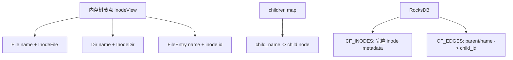
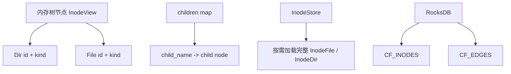

# inode_view id-only 设计稿

## 1. 文档信息

- **主题**：inode 内存树改造为 id-only 模型
- **范围**：`curvine-server` master metadata 路径，重点关注 `inode_view`、目录树、FUSE lookup / listing 行为
- **当前结论**：建议推进 id-only 方案；轻量缓存作为 Phase 2 后续优化项
- **主要使用场景**：FUSE

---

## 2. 背景与问题

当前 `inode_view` 的内存树在 master 侧承担了两类职责：

1. **拓扑索引职责**：表示目录层级、child 关系、路径遍历
2. **元数据承载职责**：在节点上长期保存完整 `InodeFile` / `InodeDir`

这导致了两个问题：

- 节点上保存了名字，而 children map 的 key 也保存了名字，存在重复
- `Dir(name, InodeDir)` 会让目录节点在内存中长期保留完整目录元数据，内存占用较高

而从持久化模型看，系统实际上已经天然具备“边点分离”的基础：

- `CF_INODES`：保存完整 inode 元数据
- `CF_EDGES`：保存 `parent/name -> child` 边关系

因此，当前设计存在进一步压缩内存树的空间。

---

## 3. 目标

本次设计目标：

1. 降低 master 侧 inode 内存树常驻内存占用
2. 统一 `File` / `Dir` / `FileEntry` 的表示方式
3. 让内存树只承担**拓扑索引**职责
4. 将完整 inode 元数据统一视为 **store-backed 数据**，按需加载
5. 在当前以 FUSE 为主要使用场景的前提下，接受可控的 metadata load 增量成本

非目标：

- 本阶段不引入大规模缓存系统
- 本阶段不重构 FUSE / FS trait 成 lightweight listing 接口
- 本阶段不追求 listing 场景的极致性能最优

---

## 4. 当前实现概览

### 4.1 当前逻辑模型

当前 `InodeView` 语义上可表示为：

- `File(String, InodeFile)`
- `Dir(String, InodeDir)`
- `FileEntry(String, i64)`

可以看到：

- `File` / `Dir` 同时带有 name 和完整元数据
- `FileEntry` 是轻量 file child 形式

### 4.2 当前持久化模型

```text
CF_INODES: inode_id -> 完整 inode metadata
CF_EDGES : (parent_id, child_name) -> child_id
```

这说明持久化层已经是：

- 点：inode metadata
- 边：目录关系 + 文件名

### 4.3 当前内存树与 store 的不一致点

当前系统处于“半轻量化”状态：

- file child 经常已经以 `FileEntry(name, id)` 形式存在
- dir child 仍然是 `Dir(name, InodeDir)`，完整目录元数据常驻内存

所以：

- **File 侧已经走出一半**
- **Dir 侧仍然是主要内存负担**

---

## 5. 现状架构图

### 5.1 当前模型



### 5.2 当前问题

```text
重复点：
1. child_name 在 edge key 和 node.name 上重复保存
2. Dir 节点在内存中长期保留完整目录 metadata
3. 文件与目录的轻量化程度不一致
```

---

## 6. 目标架构

### 6.1 目标模型

建议将内存树统一收敛为：

- **节点（node）**：`inode id + kind`
- **边（edge）**：`child_name`

完整 inode 元数据只在需要时从 `InodeStore` / RocksDB 获取。

### 6.2 目标架构图



### 6.3 设计原则

1. 名字只保留在 edge 上，不再保留在 node 上
2. 路径解析优先依赖内存拓扑，不主动 inflate 元数据
3. `FileStatus` / ACL / storage policy / nlink 等都通过 store 按需获取
4. 不因为需要元数据而重新把 rich inode tree 放回内存

---

## 7. 为什么这次主要收益来自 Dir

### 7.1 File 侧现状

当前 file child 在很多关键路径中已经是轻量形式：

- 写入 children map 时会转成 `FileEntry(name, id)`
- `create_tree()` 恢复时，文件 child 也是 `FileEntry(name, id)`
- listing/status 时，对 `FileEntry` 会临时 `store.get_inode(id, Some(name))`

因此，File 侧继续改成 id-only，主要收益是：

- 去掉 name 冗余
- 去掉 `FileEntry` 这一分裂语义
- 统一模型

但这不是根本性的变化。

### 7.2 Dir 侧现状

目录节点当前仍是：

- `Dir(name, InodeDir)`

而 `InodeDir` 中既有 children，又有完整目录元数据，包括：

- `parent_id`
- `mtime`
- `atime`
- `nlink`
- `storage_policy`
- ACL / xattr 等

因此：

- **主要内存收益来自 Dir 侧**
- **主要性能风险也来自 Dir 侧**

---

## 8. 不同场景下的性能影响分析

---

### 8.1 场景 A：路径解析 / resolve / exists

典型场景：

- `/a/b/c/d.txt` 是否存在
- parent 下是否有某 child
- 一般性的路径遍历

#### 当前行为

- 中间目录主要通过内存 children map 遍历
- 只有遇到 `FileEntry` 时，才会从 store inflate

#### 改成 id-only 后

只要目录拓扑仍保留在内存中：

- 路径解析本身仍然是内存操作
- 不会退化成每一级都去 RocksDB 扫边

#### 影响评估

- **影响较小**
- 仍然属于快路径

#### 结论

id-only 不会破坏路径拓扑遍历的基本性能模型。

---

### 8.2 场景 B：单对象 `file_status` / `stat`

典型场景：

- 获取单个 file / dir 的状态
- RPC `file_status`
- FUSE `getattr`

#### 当前行为

- `File(..)` / `Dir(..)` 通常直接 `to_file_status()`
- 目录 status 生成可以直接使用内存里的 `InodeDir`

#### 改成 id-only 后

- file 在很多路径上本来就已偏 store-backed
- dir 不再持有完整元数据后，**dir 的 status 生成需要一次额外 metadata load**

#### 影响评估

- **单个目录 status 读取会变重**
- 但这是按对象的线性成本，不是 listing 级放大

#### 结论

这是可接受的代价，但需要在 lookup/getattr 讨论里显式纳入。

---

### 8.3 场景 C：`list_status` / `list_options` / 大目录 listing

典型场景：

- API listing
- CLI 列目录
- Web UI 文件列表

#### 当前行为

- file child 若为 `FileEntry(name, id)`，已经会按需 `store.get_inode()`
- dir child 若仍是 `Dir(_, InodeDir)`，则可直接从内存拿到更多信息

#### 改成 id-only 后

目录 child 也不再携带完整元数据，因此 listing 过程将统一变成：

1. 从 children map 得到 `(name, id, kind)`
2. 对每个 child 按需加载 metadata
3. 再组装 `FileStatus`

#### 影响评估

- **大目录 listing 会明显变重**
- 风险高于 lookup
- 目录项越多，影响越大

#### 结论

这是本设计里最主要的性能风险之一。

---

### 8.4 场景 D：FUSE `readdir` / `ls`

#### 关键事实

当前 FUSE 侧并不存在真正的 lightweight listing 接口。现有链路是：

- `readdir` / `readdirplus`
- `list_stream`
- `ListStream<FileStatus>`
- common `FileSystem` trait 也将 listing 定义为 `Vec<FileStatus>` 或 `ListStream<FileStatus>`

#### 这意味着

当前 FUSE 目录读取路径是 metadata-heavy 的，而不是 name-only 的。

#### 改成 id-only 后

- `readdir` 生成完整状态的代价会上升
- 尤其是大目录，性能压力最明显

#### 影响评估

- **显著影响 listing 热点目录**
- 但在当前主要场景仍为 FUSE，且整体性能可接受的前提下，此 tradeoff 可以接受

#### 结论

FUSE `readdir` 不是本次设计的禁区，但需要作为已知成本记录。

---

### 8.5 场景 E：FUSE 逐级 lookup

典型例子：

- `/a/b/c/d.txt`

FUSE 通常会逐级 lookup：

- lookup `a`
- lookup `b`
- lookup `c`
- lookup `d.txt`

#### 当前 lookup 链路

现有实现中，FUSE lookup 不是只判断存在性，而是：

1. 由 `(parent inode, child name)` 还原 path
2. `get_cached_status(path)`
3. miss 时再走 `fs.get_status(path)`
4. 用 `FileStatus` 生成 `fuse_entry_out`

同时，FUSE 自己有一层 `NodeMap` / path 映射缓存：

- 用于根据 parent/name 恢复路径
- 不依赖 Curvine 目录完整元数据

#### 关键结论

这意味着：

- 路径拓扑查找仍然主要依赖内存结构
- 真正新增成本的是：**每一级被 lookup 到的目录对象自身，需要额外生成 `FileStatus`**

换句话说，不是：

- “父目录查孩子慢了很多”

而是：

- “每一级目录自身 status 生成多了一次 metadata load”

#### 影响量级

若路径深度为 `D`，冷路径 lookup 可粗略近似为：

- **当前**：`O(D)` 内存拓扑查找 + 少量叶子 inflate
- **改后**：`O(D)` 内存拓扑查找 + `O(D)` 级目录 metadata load

#### 影响评估

- **有影响**
- **线性、局部、可控**
- 通常比大目录 `readdir` 更容易接受

#### 结论

对于当前以 FUSE 为主的场景，lookup 变重是可接受代价。

---

## 9. 总体 tradeoff 判断

本次方案的核心 tradeoff 是：

- **收益**：显著降低 Dir 侧常驻内存
- **代价**：目录对象 status 和 listing 更依赖 store metadata load

综合判断：

1. 当前主要应用场景是 FUSE
2. 路径拓扑仍在内存中
3. lookup 的影响局部且线性
4. File 侧本来就已有 store-backed 逻辑
5. 当前整体性能仍可接受

因此：

- **当前接受 id-only 是合理的**

---

## 10. 为什么当前可以先不做缓存

本次设计中，轻量缓存被明确定位为 **Phase 2**，原因如下：

1. 当前优先级是先拿到内存收益
2. 若第一阶段同时引入缓存，会混淆收益来源和性能边界
3. 现有 FUSE 侧已经有：
   - `path -> FileStatus` meta cache
   - FUSE attr / entry TTL
   - node/path 映射缓存
4. 当前整体性能判断是可接受的

因此更合理的策略是：

- **Phase 1：先完成 id-only 改造**
- **Phase 2：观察实际性能后再做目录轻量缓存**

---

## 11. Phase 2：轻量缓存优化方向

### 11.1 目标

在保持 id-only 模型不回退的前提下，降低目录 metadata load 对热点路径的影响。

### 11.2 优先优化对象

优先考虑：

- **目录 status / 目录 metadata 的轻量缓存**

原因：

- 新增成本主要来自目录对象
- FUSE lookup 热点路径会反复访问相同目录前缀
- 对目录做轻量缓存收益集中

### 11.3 不建议的缓存方式

不建议：

- 把完整 `InodeDir + children` 再缓回内存
- 重新回到 rich inode tree 常驻模式

### 11.4 建议缓存形式

可以考虑缓存：

- 构造目录 `FileStatus` 所需的最小字段
- 或一个轻量目录 status 视图

### 11.5 可能的缓存层次

1. **FUSE 侧 path -> FileStatus 缓存**
   - 当前已经存在
   - 对热点 lookup 已有帮助

2. **服务端目录 metadata/status 轻量缓存**
   - 对 FUSE 与非 FUSE 场景都有效
   - 更适合作为 Phase 2 优化点

---

## 12. 风险与约束

### 12.1 功能性风险

- 现有大量 API 默认 `InodeView` 携带完整元数据
- `child.name()`、`to_file_status()`、`as_dir_mut()`、`change_name()` 等都需要调整
- rename / set_attr / journal replay 等逻辑需要重新梳理“拓扑”和“元数据”职责边界

### 12.2 性能风险

- 单个目录 status 读取增加 store load
- 深路径 cold lookup 成本上升
- 大目录 listing / FUSE `readdir` 变重

### 12.3 设计约束

- 目录树拓扑必须继续保留在内存中
- 不能为了补性能，把 rich metadata 全量放回树上
- 后续缓存应是轻量、局部、可失效的

---

## 13. 实施阶段建议

### Phase 1：id-only 改造

目标：

- `InodeView` 只保留 `id + kind`
- 名字只保留在 edge / children map key 上
- metadata 一律按需通过 store inflate

验收重点：

- 语义正确
- FUSE 主链路可用
- 内存占用下降明显

### Phase 2：性能观察与轻量缓存

重点观察：

- FUSE lookup 热路径延迟
- 深层目录 cold path 延迟
- 大目录 `readdir` 延迟
- store 读放大情况

若有必要再引入：

- 目录 status 轻量缓存
- 必要的批量 metadata load

---

## 14. 验收标准

### 14.1 功能验收

- 路径解析语义不变
- FUSE lookup / getattr / readdir 正常工作
- `file_status` / `list_status` / `list_options` 结果正确
- rename / delete / set_attr / journal replay 不破坏一致性

### 14.2 性能验收

- inode 内存树常驻内存显著下降
- FUSE lookup 性能无不可接受退化
- 大目录 listing 的退化在预期范围内

### 14.3 架构验收

- 内存树只负责拓扑
- 元数据权威来源统一回到 store
- 不重新引入 rich inode tree 常驻缓存

---

## 15. 最终结论

本设计的最终判断如下：

1. **inode 内存树改为 id-only 是合理方向**
2. **主要收益来自 Dir 侧，而不是 File 侧**
3. **主要性能影响也集中在 Dir 侧，特别是目录 status、listing、FUSE readdir**
4. **FUSE 逐级 lookup 会变重，但影响主要是目录自身 metadata 读取，不是路径拓扑遍历退化**
5. **在当前以 FUSE 为主的使用场景下，这个 tradeoff 可以接受**
6. **轻量缓存是合理后续优化方向，但建议作为 Phase 2 单独实施**

最终推进原则：

- **先做 id-only，优先拿内存收益**
- **再根据 FUSE 实际运行效果决定是否补目录轻量缓存**
